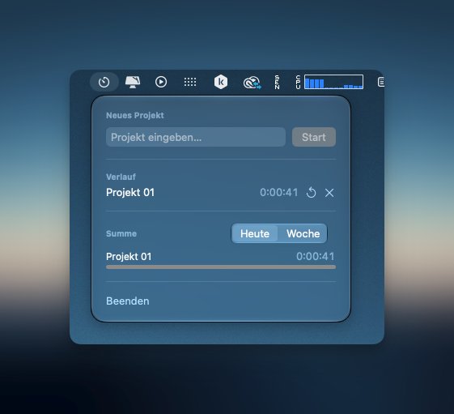
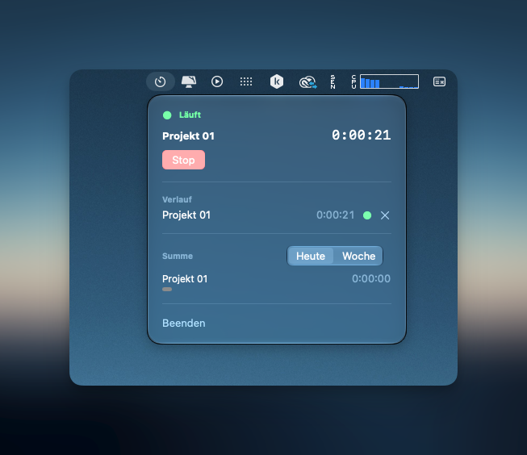

# TimeGlass

A tiny native macOS menu-bar time tracker. Click the icon, type a project name, hit Start. It ticks live in the menu bar, keeps a history you can restart or delete from, and shows today/week totals per project — all in a Liquid Glass popup, no windows, no Dock icon.

<p align="center">
  
  
</p>

## Features

- **Menu bar only** — no Dock icon, no separate app window. The current project and elapsed time show right in the menu bar while a timer runs.
- **One active timer at a time** — starting a new project automatically stops whatever was running.
- **History** — every project you've tracked, with today's total, one-tap restart, and a two-tap confirm to delete (including the currently running one).
- **Today / Week summary** — per-project totals with proportional bars.
- **Autostart at login** via `SMAppService` — always there when you need it.
- **Liquid Glass UI** — built with SwiftUI's `.glassEffect()`.

## Requirements

- macOS 26 (Tahoe) or later — `.glassEffect()` isn't available on earlier versions.
- Xcode (matching macOS 26 SDK).
- [XcodeGen](https://github.com/yonaskolb/XcodeGen) to generate the `.xcodeproj` (`brew install xcodegen`).

## Building & Running

```bash
git clone https://github.com/gabrielh161/TimeGlass.git
cd TimeGlass
xcodegen generate
open TimeGlass.xcodeproj
```

In Xcode, select your team under the `TimeGlass` target's *Signing & Capabilities* tab, then Run (⌘R).

To build and test from the command line instead:

```bash
xcodebuild -project TimeGlass.xcodeproj -scheme TimeGlass -destination 'platform=macOS' build
xcodebuild -project TimeGlass.xcodeproj -scheme TimeGlass -destination 'platform=macOS' test
```

## Architecture

- **SwiftUI `MenuBarExtra`** for the menu bar item and popup, no separate app window.
- **SwiftData** for local persistence — no server, no account, no sync.
- A single `TimeTracker` type owns the `ModelContext` and enforces the app's core rule: at most one running time entry across all projects, at any moment.

## License

MIT — see [LICENSE](LICENSE).
